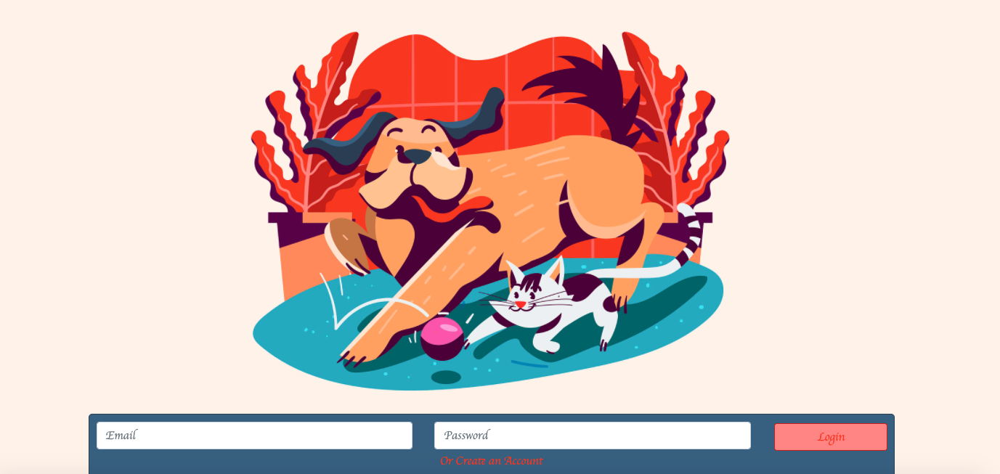

# Self-Care Sidekick
## Description
This application allows a user to take care of a sidekick by completing self-care tasks.
## Table of Contents
* [Installation](#installation)
* [Usage](#usage)
* [License](#license)
* [Contributing](#contributing)
* [Questions](#questions)
### Installation
npm i
### Usage
You run this application in terminal or bash with server.js locally with 8080. If you are doing so you need a .env file in your root folder with:
* DB_USERNAME=root
* DB_PASSWORD=yourpassword
* DB_NAME=selfcare_sidekick

As well as the mySql code
* DROP DATABASE IF EXISTS selfcare_sidekick
* CREATE DATABASE selfcare_sidekick
* USE selfcare_sidekick

 It is run not locally with heroku.
### License
MIT
### Contributing
No contributors allowed.
### Questions
* GitHub repository URL: https://github.com/sharlenemay/personal_pet
* Heroku deployed URL: https://mysterious-oasis-64006.herokuapp.com/

### Developers

#### Anna Conover
* Github username: annaxgrace
* Email: anna.grace.conover@gmail.com
* GitHub Profile URL: https://github.com/AnnaxGrace

#### Sharlene May
* Github username: sharlenemay
* Email: sharleneminosa@gmail.com
* GitHub Profile URL: https://github.com/sharlenemay

#### Julia "Jace" Clements
* Github username: tiiedye
* Email: tiiedye@gmail.com
* GitHub Profile URL: https://github.com/tiiedye

#### Daniel
* Github username: returntrip444
* Email: danp777991@gmail.com
* GitHub Profile URL: https://github.com/returntrip444

    